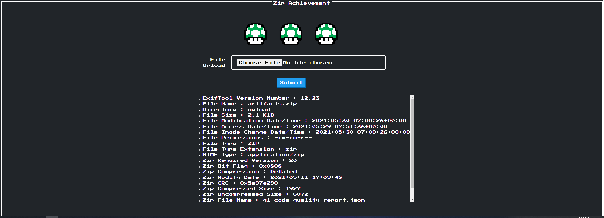

# ctf-challenges



## Challenge:  Zip! achievement
## Description

Give me a zip file, I will tell you all about it, including the flag in /etc/flag.txt/

## Hint 

1. Do you know CVE-2021-22204
2. I think blog of vakzz bug hunter is very interesting

## Flag 

```sh
HCMUS-CTF{CVE_22204_1s_v3ry_1nt3r3st1ng}
```

## Ý tưởng

Challenge được lấy ý tưởng từ cve-2021-22204 ( cve này được sử dụng đểtạo payload dạng jpeg dùng cho việc exploit Gitlab). Đây là một trong những CVE khá nổi tiêng gần đây. Vì mã khai thác dưới dạng format hình ảnh (jpeg) đã có sẵn, nên đề ra sẽ customize lại, yêu cầu mã khai thác phải ở định dạng ZIP mới có thể lấy được flag.

## Giải thích

### Description: Give me a zip file, I will tell you all about it, including the flag in /etc/flag.txt/

Giúp các bạn sinh viên biêt được file flag nằm ở /etc/flag.txt nhằm phục vụ cho mục đích viết payload.

### Hint 1. Do you know CVE-2021-22204

Biêt được đây là CVE-2021-22004 và người cho chơi thể tìm kiếm các blog để tạo được mã khai thác dưới định dạng dễ nhât là *Djvu* 

### Hint 2: I think blog of vakzz bug hunter is very interesting
 
 Giúp các bạn sinh viên có thể tìm ra được blog của author (https://devcraft.io/2021/05/04/exiftool-arbitrary-code-execution-cve-2021-22204.html).
 Ở blog giúp các bạn sinh viên hiểu rõ về bug và các tạo mã khai thác dưới định dạng jpeg. Các bạn cần nắm vững kiên thức ở quy trình tạo payload jpeg, từ đó chỉ cần một số bước nhỏ có thể tạo payload ở dạng ZIP ( cuối blog tác giả cũng đã giải thích cho các tạo payload ở định dạng zip nhưng không có mì ăn liền, vì vậy có làm mới có ăn.)
 
 
## Install

Clone project...

```sh
git clone https://github.com/hongson97/ctf-challenges.git
```

Replace IP api trong templates/upload.html thành IP của server deploy

Chạy docker-compose...

```sh
cd ctf-challenges
docker-compose up
```

